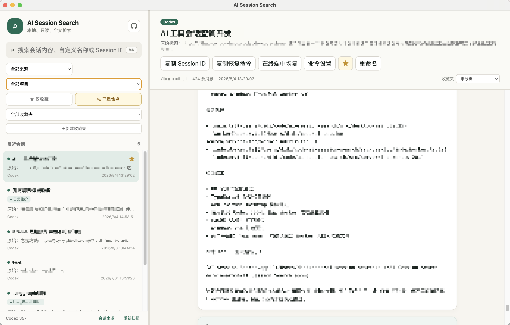

# AI Session Search

English | [简体中文](./README.zh-CN.md)

[](https://github.com/lililib/ai-session-search/releases)
[](./LICENSE)

A local-first, read-only search and viewer for AI coding sessions. It automatically discovers
conversations from eleven supported coding agents and indexes them with SQLite FTS5 trigram search, making it
easy to find natural language, code identifiers, file paths, and error messages.



## Features

- Automatically discovers Claude Code, Codex, Antigravity, OpenCode, Hermes, GitHub Copilot CLI, Droid, OpenClaw, Cursor, Pi, and Kimi Code sessions
- Searches across all providers or filters by provider and project
- Full-text search powered by SQLite FTS5 trigram indexing
- Substring fallback for two-character Chinese queries
- Read-only conversation viewer with matched-message navigation
- Custom session titles
- Favorite and renamed-session filters
- Searches custom titles while preserving and displaying original titles
- Creates, renames, and deletes local collections
- Organizes sessions into collections or filters uncategorized sessions
- Copies Session IDs and resume commands
- Supports provider-specific custom resume command templates
- Automatically selects English or Simplified Chinese from browser language preferences
- Reindexes sessions automatically when source files change
- Requires no Anthropic API, OpenAI API, or cloud database

AI Session Search never modifies source session files. Custom titles, favorites,
collections, settings, and the search index are stored only in the application's own SQLite
database.

## Copy and resume commands

Open a session to copy its Session ID or a complete resume command. Built-in templates are available for Claude Code, Codex, Antigravity, OpenCode, Hermes, Copilot CLI, Cursor, Pi, and Kimi Code. For example:

```text
Claude Code: cd {cwd} && claude --resume {sessionId}
Codex:       cd {cwd} && codex resume {sessionId}
```

`{cwd}` is replaced with the project directory recorded by the session, and `{sessionId}` is
replaced with the source Session ID. Templates are stored separately for each provider in the
application database. A custom prefix such as `yolo` is also valid and produces
`yolo <session-id>`.

## Automatic discovery and configuration

Paths are resolved using the following precedence:

| Data | CLI option | Application environment | Native environment | Default |
| --- | --- | --- | --- | --- |
| Claude Code | `--claude-dir` | `AI_SESSION_CLAUDE_HOME` | `CLAUDE_CONFIG_DIR` | `~/.claude` |
| Codex | `--codex-dir` | `AI_SESSION_CODEX_HOME` | `CODEX_HOME` | `~/.codex` |
| Other providers | `--provider-dir provider=path` | `AI_SESSION_<PROVIDER>_HOME` | Provider-specific when available | See the table below |
| Application data | `--data-dir` | `AI_SESSION_DATA_DIR` | `XDG_DATA_HOME` | Platform application data directory |

### Command-line options

Command-line options take precedence over environment variables.

| Option | Environment variable | Default | Description |
| --- | --- | --- | --- |
| `-p, --port <port>` | `PORT` | `3411` | Port used by the web server |
| `-h, --hostname <hostname>` | `HOSTNAME` | `localhost` | Hostname or network interface to listen on |
| `--claude-dir <path>` | `AI_SESSION_CLAUDE_HOME`, then `CLAUDE_CONFIG_DIR` | `~/.claude` | Claude Code home directory |
| `--codex-dir <path>` | `AI_SESSION_CODEX_HOME`, then `CODEX_HOME` | `~/.codex` | Codex home directory |
| `--provider-dir <provider=path>` | Provider-specific | Provider-specific | Override a provider home; may be repeated |
| `--data-dir <path>` | `AI_SESSION_DATA_DIR`, then `XDG_DATA_HOME` | Platform application data directory | Application database directory |
| `--providers <providers>` | `AI_SESSION_PROVIDERS` | `auto` | `auto` or a comma-separated provider list |
| `--no-watch` | — | Watching enabled | Disable automatic reindexing when session files change |
| `--help` | — | — | Display CLI help |

Example:

```bash
corepack pnpm start -- --hostname 127.0.0.1 --port 8080
```

Supported provider IDs and default homes:

| Provider ID | Client | Default home |
| --- | --- | --- |
| `claude` | Claude Code | `~/.claude` |
| `codex` | Codex | `~/.codex` |
| `antigravity` | Antigravity | `~/.gemini` |
| `opencode` | OpenCode | `~/.local/share/opencode` |
| `hermes` | Hermes | `~/.hermes` |
| `copilot` | GitHub Copilot CLI | `~/.copilot` |
| `droid` | Droid / Factory | `~/.factory` |
| `openclaw` | OpenClaw | `~/.openclaw` |
| `cursor` | Cursor | `~/.cursor` |
| `pi` | Pi | `~/.pi` |
| `kimi` | Kimi Code | `~/.kimi-code` |

For example, `--provider-dir kimi=/custom/kimi --provider-dir pi=/custom/pi` overrides two homes without hardcoding a user directory. Only providers selected by `--providers` are scanned; `auto` enables automatic detection for all registered providers.

Claude Code discovery:

```text
<claude-home>/projects/**/*.jsonl
```

Codex discovery:

```text
<codex-home>/sessions/**/*.jsonl
<codex-home>/archived_sessions/**/*.jsonl
```

`history.jsonl` and `session_index.jsonl` are not used as session discovery sources. Codex
`session_index.jsonl` is used only to enrich titles for sessions that were already discovered.

## Internationalization

The interface uses Lingui and automatically selects a locale from browser language preferences:

- `zh-*`: Simplified Chinese
- `en-*`: English
- Any other language: English fallback

Locale detection and translation catalogs live in `src/client/i18n/`. To add a language, create
its catalog and register its language-tag mapping in `localeDetection.ts`.

## Local development

Requirements:

- Node.js 24 or later, for the built-in `node:sqlite` module
- pnpm 11

```bash
corepack pnpm install
corepack pnpm dev
```

Development servers:

- Frontend: http://localhost:3410
- Backend: http://localhost:3411

Production build:

```bash
corepack pnpm build
corepack pnpm start
```

Enable only Codex and provide custom directories:

```bash
corepack pnpm start -- \
  --providers codex \
  --codex-dir /path/to/codex-home \
  --data-dir /path/to/app-data
```

Disable file watching:

```bash
corepack pnpm start -- --no-watch
```

## Validation

```bash
corepack pnpm test
corepack pnpm typecheck
corepack pnpm build
```

## Privacy boundaries

- The index stays entirely on the local device.
- The application does not read `auth.json`, API keys, or login credentials.
- It copies resume commands but never executes, sends, resumes, or continues sessions.
- It never executes commands or tool calls found in session content.
- Add authentication and network access controls before exposing the service remotely. By
  default, it listens only on `localhost`.

## Upstream and license

The search architecture is inspired by and adapted from
[d-kimuson/claude-code-viewer](https://github.com/d-kimuson/claude-code-viewer), which is licensed
under the MIT License. See [NOTICE.md](./NOTICE.md) for attribution. This project is also licensed
under the MIT License.
